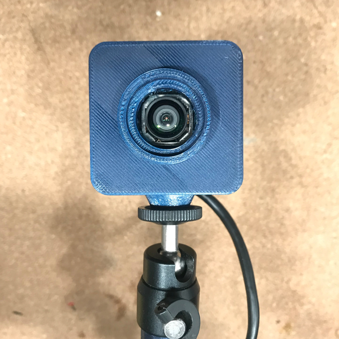
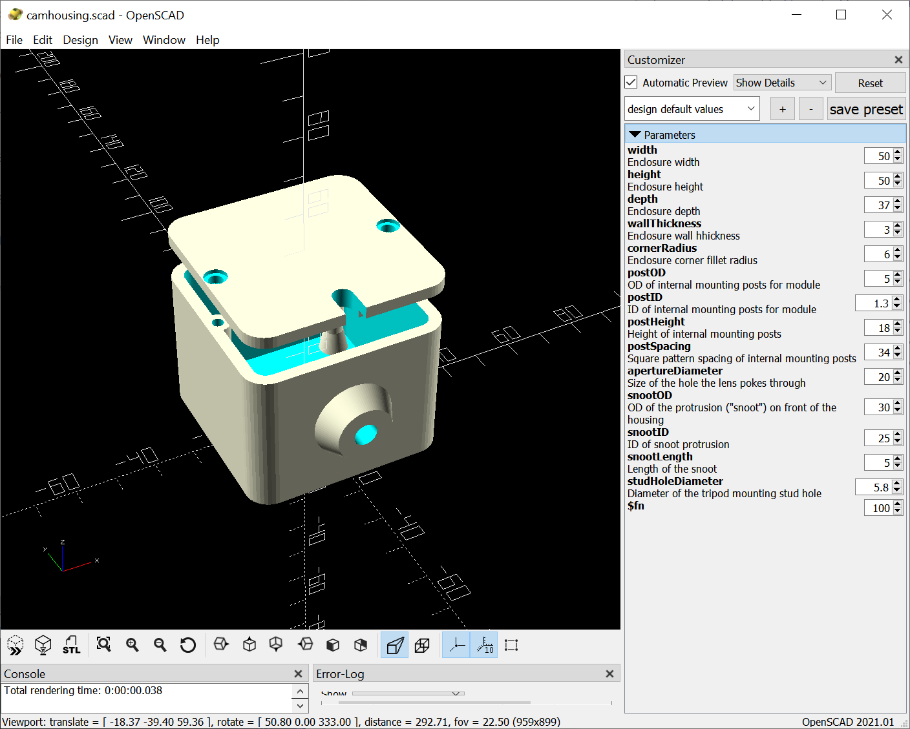

# Cubecam-Generator

---
> OpenSCAD Cubular Camera Module Housing Generator

## Overview
OpenSCAD script to generate cubical "science camera" style housings for the common ~40x40mm board-level USB camera modules that can be found on the Bay site and the River site.
Some of these modules are quite nice, with 4K and autofocus, and this makes little 3D printable houses for them.

  

---
## Usage

  

Install [OpenSCAD](https://openscad.org) and the [Round-Anything Library](https://github.com/Irev-Dev/Round-Anything).

Most parameters you need are exposed in the OpenSCAD customizer, modify them as you see fit to match your camera module and lens requirements.

I recommend printing this "face up" with internal supports for best outward appearance. The internal mounting posts can be a bit of a pain this way.

With PETG the layer bonds are robust enough that a "standard" 1/4-20 style tripod stud can be screwed directly into the plastic without splitting it. 
If printing in PLA, I recommend making the tripod stud hole oversized and pushing a knurled brass insert into it. Overall PETG is the way to go if you have it.

**Brass inserts can be found using the search incantation "1/4-20 threaded heat set insert" on the River site.**

---
## References
[OpenSCAD](https://openscad.org/)
[Round-Anything Library](https://github.com/Irev-Dev/Round-Anything)
